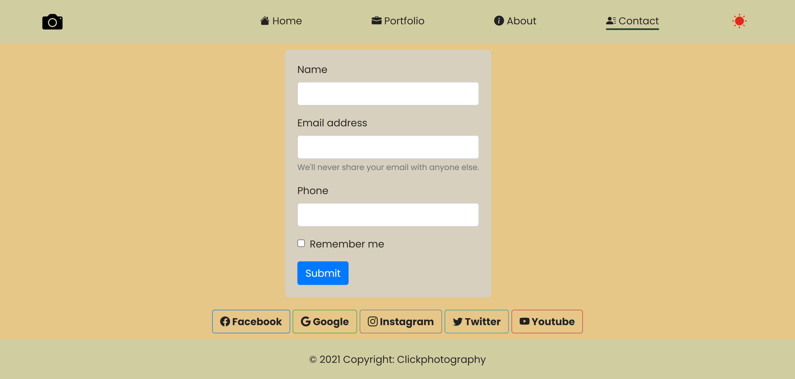

# PhotoAlbum

Angular project which demonstrates photography website. The application showcases my captured moments and my designs.
 
 

### _About the project_
The photography website consists of following components
* Home : Contains carousel and cards presentation
* Portfolio : Displays all my works on photography
* About : Its about me
* Contact : Sample form and social network demo integrations
 
 

### _Technologies implemented_
* Angular, Typescript usage for application 
* Components designed using HTML and CSS
* Dependency injection of Service and Utility classes
* Bootstrap for responsive design
 
 

---
### _This is how it looks like_
 

 

 

 

